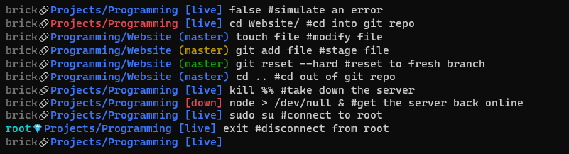

# Clean Bash Prompt

A clean custom bash prompt designed for maximum efficiency

## Features



This bash prompt is divided into 3 parts:

1. Current username
   - It is gray when logged into a normal user and becomes cyan when logged into a user with sudo privileges (`$UID=0`)
2. Current path
   - It displays the two deepest directories from the current path (`$PWD`)
   - It is blue by default and turns red when the previous command returned an error (`$?!=0`)
3. Extra info
   - When inside a GIT repository, it displays the current active branch
     - It is blue on a fresh branch
     - It becomes yellow on a modified branch
     - It becomes green on a staged branch
   - When outside a GIT repository, it displays the status of a specific process (default is `bash`)
     - It displays a blue _live_ when the process is running and a red _down_ when it isn't
     - After installation, one can modify which process status is displayed

## Installation

Run the following to install the promt in your `.bashrc`

```bash
#clone the repository
git clone https://github.com/Bricktech2000/Clean-Bash-Prompt.git
cd Clean-Bash-Prompt/

#copy the script to ~/bashrc
cat src/prompt.sh >> ~/.bashrc

#rerun your .bashrc
source ~/.bashrc
```

## Configuration

Run the following to modify which process status is displayed (see [Features](#features)):

```bash
#display status of the `node` process (useful on servers running NodeJS)
echo 'export CLEAN_PROMPT_CHECK_PROC="node"' >> ~/.bashrc
```

## Uninstallation

To uninstall `Clean-Bash-Prompt`, delete the lines that were added to your `.bashrc` and restart your shell.
